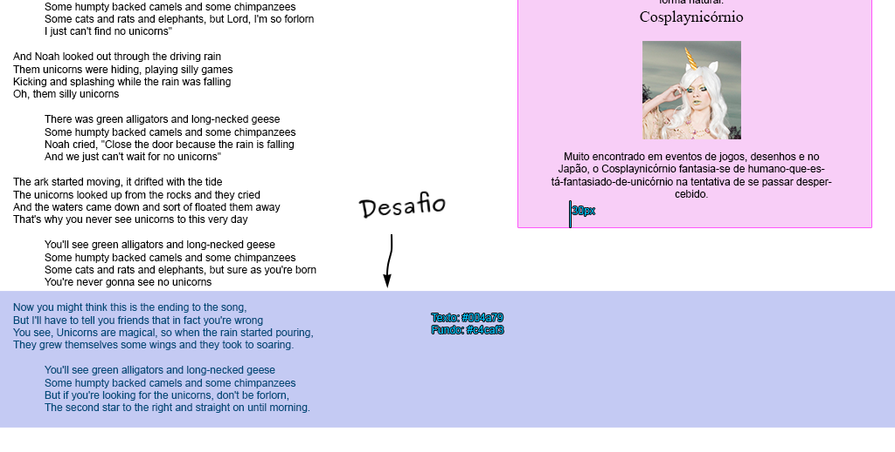

# _Unicorns are real_

[Baixe os arquivos][baixar] aqui.
Uma página web **fabulosa** contando a origem, os mitos e a verdade sobre os
unicórnios.

[baixar]: https://github.com/fegemo/cefet-front-end-unicorns/archive/refs/heads/main.zip

## Atividade

Um _web designer_ criou a parte artística de uma página  web usando seu
programa de edição de imagens predileto (_e.g._, Photoshop) e lhe entregou
dois arquivos (<abbr title="Comprehensive Layout">comp</abbr>:
`unicorns-comp.png`, <abbr title="Specifications">specs</abbr>:
`unicorns-specs.png`) para que você crie a página propriamente dita,
usando HTML e CSS.

Você deve estilizar a página (`index.html`) de forma a fazê-la exatamente
igual ao que o _web designer_ vislumbrou.

Veja o _layout_ no arquivo `unicorns-comp.png` e as _specs_ no arquivo `unicorns-specs.png`.

O código HTML está praticamente
pronto e será necessário alterá-lo apenas para fazer as quebras de linha
da letra da música.

Além disso, coloque também um elemento audio, logo abaixo
do título "A Música do Unicórnio", usando o arquivo
`audio/brobdingnagianbards_theunicornsong.mp3`.

## Desafios

1. Tente estilizar a margem dos parágrafos usando seletores que não são
   de classes/IDs.
   - Existem seletores que permitem selecionar o
     "enésimo elemento" (n-ésimo) de um tipo, como o `:nth-of-type(2n)` para
     selecionar os elementos pares e `:nth-of-type(2n+1)` para os ímpares.
     Além dele, também tem o `:nth-child(2n)` que pega os filhos pares e
     `:nth-child(2n+1)`. Em vez de `2n`, é possível escrever `even` ("par" em
     inglês) e, em vez de `2n+1`, é possível escrever `odd` (ímpar).
1. Tente estilizar os dois últimos parágrafos, colocando-os dentro de uma `
` de forma que fiquem semelhantes à imagem abaixo:

  
1. Faça sua página ser **_pixel-perfect_** com os _specs_, ou seja, a página
   tem que seguir exatamente o que foi proposto
1. Decore a letra da música até o final da aula e vamos todos cantar \o/ ;)

## FAQ

- Que **fonte é essa "Kaushan Script"**? Acho que não funcionou.
  - Ela é uma fonte que normalmente não está instalada nos computadores. Nesse caso, você pode usar a fonte que está **hospedada no Google Fonts** (procure por Kaushan Script lá)
- **Espacinho branco** ao redor da página. Como tirar?
  - Por padrão, o elemento `<body>` possui uma margem de `8px` nas quatro
    direções. Esse espaço é devido a isso.
- **Espação em branco no topo** da página. O que está provocando ele?
  - Investigue, usando **as ferramentas do desenvolvedor**, aquele espaço
    clicando com botão direito no espaço em branco e, então, escolhendo
    a opção "Inspecionar"
    - Quando a árvore de elementos HTML abrir, vá selecionando os elementos
      próximos até ver quem está provocando esse espaço em branco
      - Dica: é a margem padrão de alguém
- Como faço a quebra de linha?
  - Usando a tag ` `, como [no slide][br]
- Minha `
` parece estar mais larga que o normal. Por quê?
  - Isso é por causa do _Box Model_! Reveja a [explicação sobre ele nos slides][box-model]

[box-model]: https://fegemo.github.io/cefet-front-end/classes/css3/#box-model
[br]: https://fegemo.github.io/cefet-front-end/classes/css3/#quebra-de-linha
